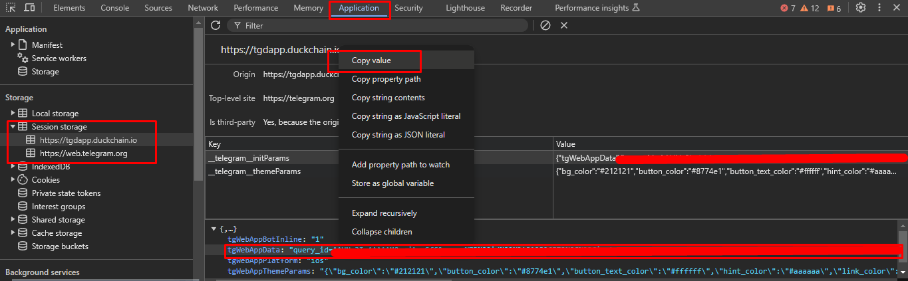
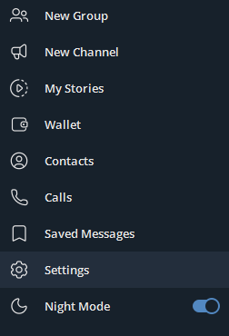
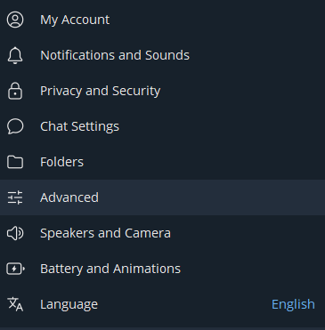
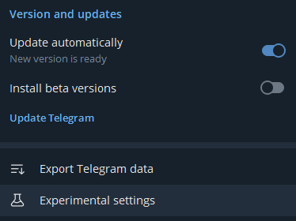
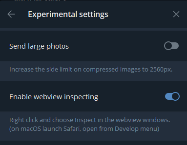

# DuckChain Clicker
🖱️ Join Here 🦆 [DuckChain](https://t.me/DuckChain_bot/quack?startapp=GYs5RJKu)

🖱️ Join Telegram [Update Tools](t.me/airdropdigitalcuan)

### Features
- Clik per Second 
- Multi Account
- Daily Login 
- Clear Task

### Install
- #### Windows

1. Make sure you computer was installed python and git.
   
   > python site : [https://python.org](https://python.org)   
   > git site : [https://git-scm.com/](https://git-scm.com/)

2. Clone this repository
   ```bash
   git clone https://github.com/mahiradev1/DuckChain.git
   ```

3. goto DuckChain-Bot directory
   ```bash
   cd DuckChain
   ```

4. install the require library
   ```bash
   pip install -r requirements.txt
   ```

5. fill the `tokens.txt` file with your data, how to get data you can refer to [How to Get Data](#how-to-get-data)

6. execute the main program 
   ```bash
   python bot.py
   ```
---
### How to Get Data
1. Open bot [DuckChain](https://t.me/DuckChain_bot/quack?startapp=LCsh43WH)
2. right click -> select Inspect or ```ctrl + shift + i```
3. Go to tab Application.
4. Go to Session Storage -> Choose ```https://tgdapp.duckchain.io```
5. copy value ```tgWebAppData``` query_id=xxxxx


---
if you are using the desktop version of telegram, you have to enable ```enable webview inpescting``` Here's the tutorial:
1. Enter the ```Setting``` menu
   


2. select the ```Advanced``` menu
   


3. Scroll down bottom and select ```Experimental Settings```
   


4. then select ```Enable Webview Inspecting```
   

---

#### if you find this project useful, please consider giving it a star!

# ⭐⭐⭐
